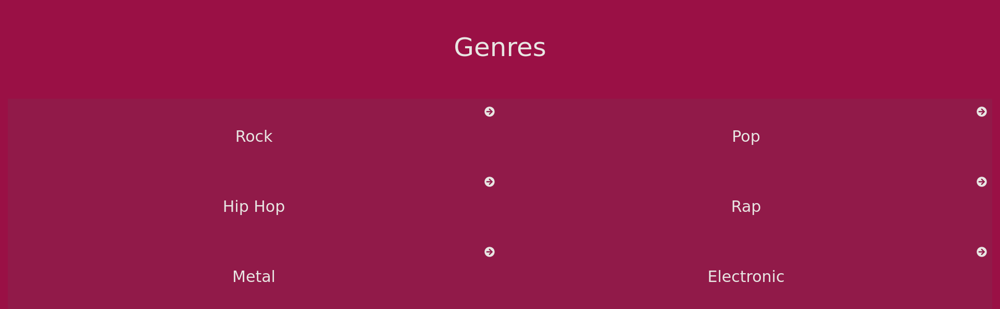

# MusicApp

> A mobile web application to search and view artists and songs.

[Live Demo](https://mistermaxis-music-app.netlify.app/)

## Built With

- HTML, JavaScript, CSS
- Webpack, React, Jest

## Getting Started

To get a local copy up and running follow these simple example steps.

### Prerequisites

- Nodejs

### Setup

- Clone the repository to a folder in your PC.

### Install

- Navigate to the folder where you cloned the repo (eg: `Documents/MusicApp`).
- Once in the folder, open a terminal window from there.
- Alternatively, you can open a terminal from a shortcut and navigate to the folder using the command `cd` (eg: `cd Documents/MusicApp`):
- Run `npm i` to install all the necessary dependencies.

### Usage

- Run `npm start` to start a local server at `localhost:3000`.

### Run tests

- Run `npm test` to run tests if available.

## Authors

👤 **Maximiliano Diaz**

- GitHub: [@mistermaxis](https://github.com/mistermaxis)
- LinkedIn: [Maximiliano Diaz](https://linkedin.com/in/mistermaxis)

## 🤝 Contributing

Contributions, issues, and feature requests are welcome!

Feel free to check the [issues page](../../issues/).

## Show your support

Give a ⭐️ if you like this project!

## Acknowledgments

- Microverse

## 📝 License

This project is [MIT](https://mit-license.org/) licensed.